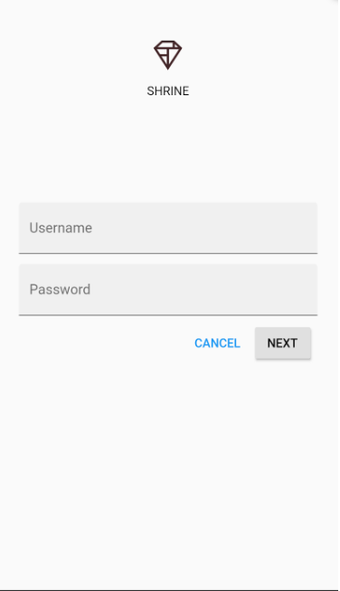
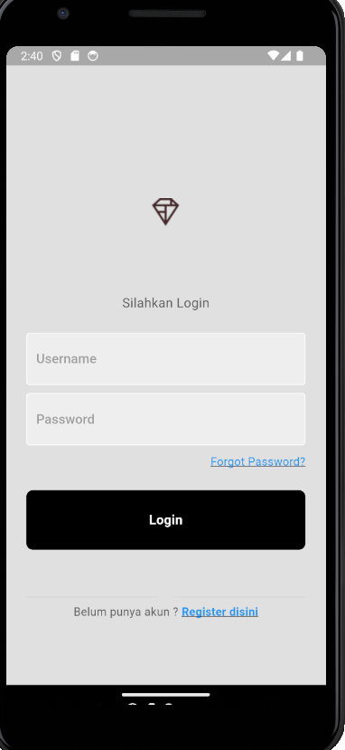
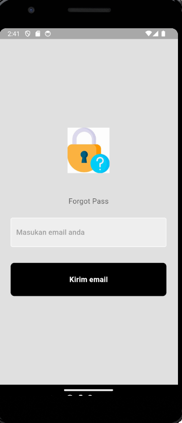
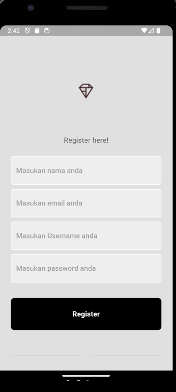
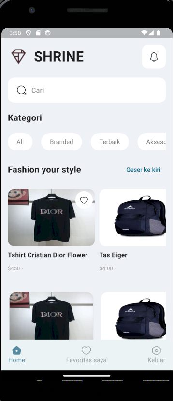

# Tugas mcd proyek 4 

Ahmad al fajri 221511039

Tugas aplikasi mcd codelabs berbasic flutter 

Brikut penjelasan dari hasil uji coba aplikasi dan perubahan perubahan yang di lakukan, berikut tampilan login normal sesuai tutorial  
 
 
Lalu saya merubah bagian tampilan login serta menambahkan halaman register dan lupa password 
 
 

Setelah login lalu masuk ke halaman dashboard atau beranda

saya merubah bagian tampilan home nya dengan menambahkan search bar,merapihkan tampilan 
lalu menambahkan halaman baru yaitu halaman Favorit barang yang disukai user

## Getting Started

This project is a starting point for a Flutter application.

A few resources to get you started if this is your first Flutter project:

- [Lab: Write your first Flutter app](https://docs.flutter.dev/get-started/codelab)
- [Cookbook: Useful Flutter samples](https://docs.flutter.dev/cookbook)

For help getting started with Flutter development, view the
[online documentation](https://docs.flutter.dev/), which offers tutorials,
samples, guidance on mobile development, and a full API reference.
